# Quickstart: Mac OS

This is a very quick guide to get a bootable Mac OS system ready for Mini vMac DS(i).  

Requirements:
- Internet connection
- Modern browser
- Approximately 1.1GB of free space on your DS(i) SD card

We're going to use [Infinite Mac](https://infinitemac.org/) to install System 6.0.8, a few utilities, and some games to a disk image that we will use in Mini vMac.  

Start by navigating to Infinite Mac and scroll through the operating systems until you reach System 7.5.
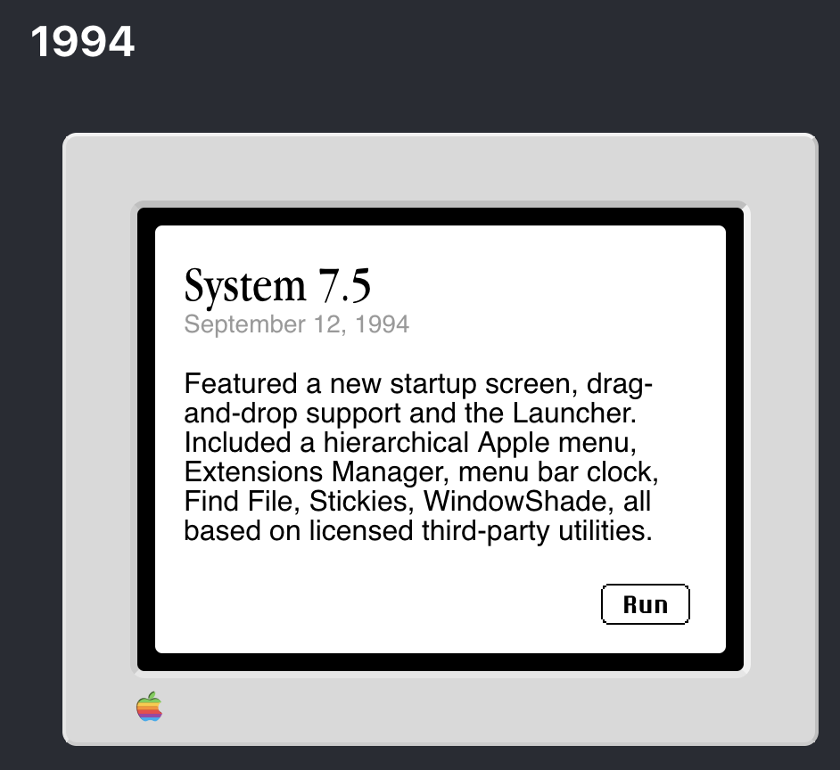

Click the run button and wait for the machine to start up and reach the desktop.  
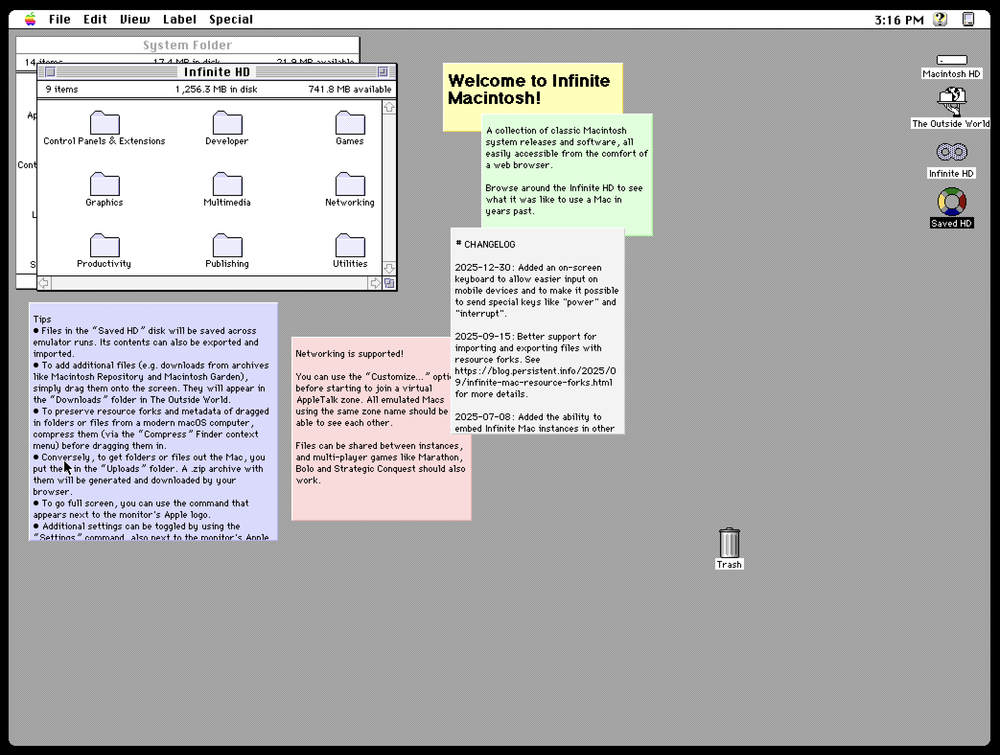

Notice the "Saved HD" icon on the desktop.  
This is where we will be installing everything; later, we will download this drive as a disk image to use in Mini vMac.

Before we install the operating system, take a look at the bottom of the screen:
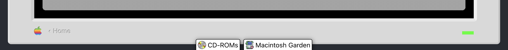

This allows access to multiple sources of Applications, operating systems, and more, but for now we're just going to stick with the System software.

Click the CD-ROMs button and notice a pop-up appear with a browsable catalog of CD-ROM images you can mount.  
Scroll down until you find "Apple Legacy Recovery CD" under System Software/Compilations.

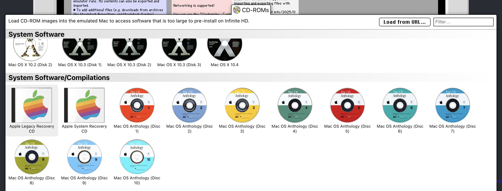

Click on it and you will notice a new icon on the desktop named "Legacy Recovery".  
Double click the icon to open the disk and navigate to the "Mac OS" folder.

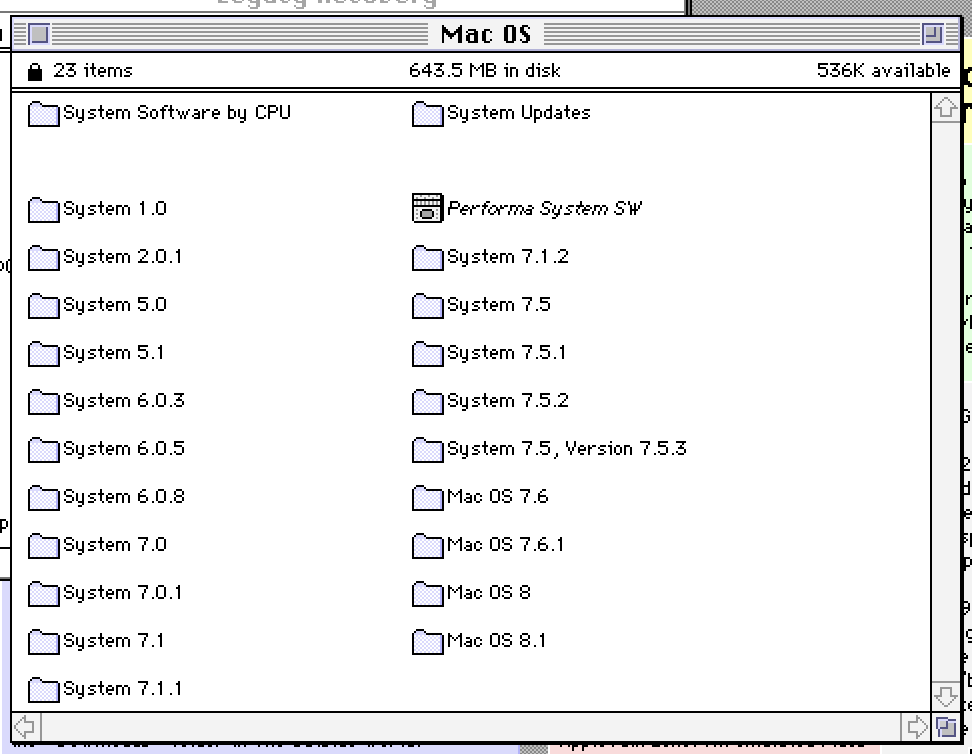

Double-click the "System 6.0.8" folder and then do the same for the "6.0.8 1440K" folder within.
Double-click the file called "Net Install.scr" and the installation process will begin.

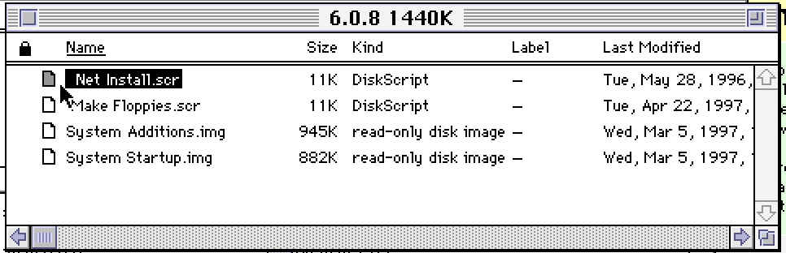
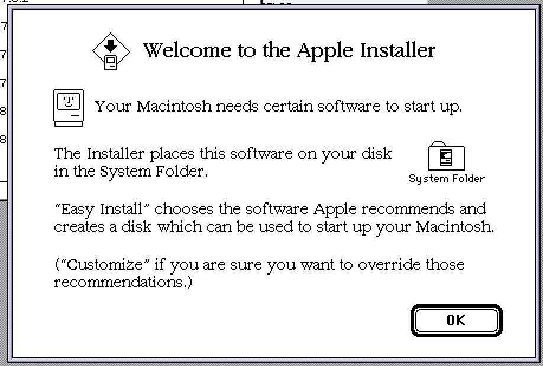

Click "Ok" to advance to the next screen and take notice of the text.  

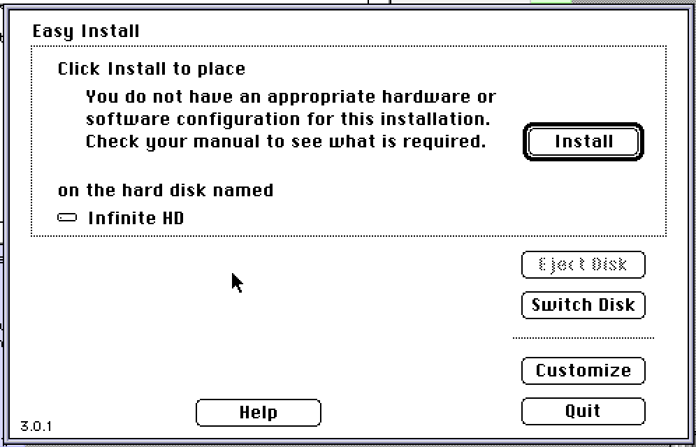

Notice that it wants to install to the "Infinite HD" disk; this is not what we want.  
Press the "Switch Disk" button until the destination disk is "Saved HD".  

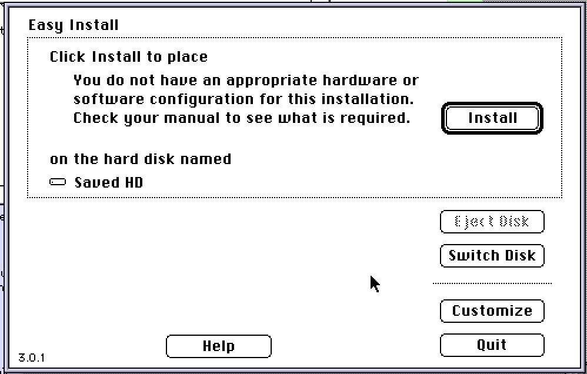

Once the destination is correctly set to "Saved HD" click on the "Customize" button.
We're only going to install a small subset of the available system software.

Scroll down the list of options and make sure that only "System software for Macintosh Plus" is selected.

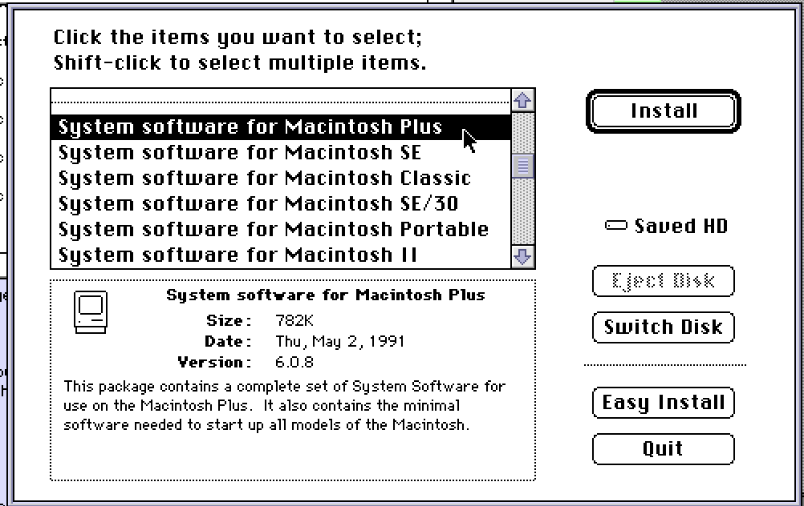

Click the install button and wait for the process to finish.  
When the installer asks if you want to want to do additional installations, click "Quit".

If you open up the "Saved HD" disk on the desktop, you'll notice that it now contains a system folder.  
This means the OS was successfully installed and we can add some essential utilities and some games.

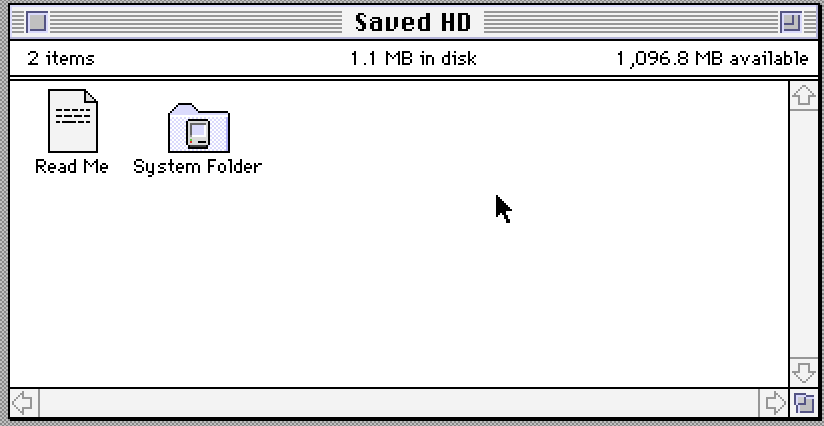

Back on the Macintosh desktop, open the "Infinite HD" folder.

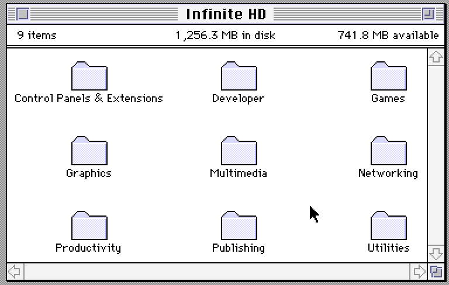

From the "Utilities" folder, drag the "Stuffit Expander 5.5" folder onto the "Saved HD" icon on the desktop. Note that we're not moving Stuffit Expander to the desktop; if it ends up on the desktop instead then pick it up and drag it onto the "Saved HD" icon to make sure it gets copied.

Also from the "Utilities" folder, drag the "Disk Copy" folder onto "Saved HD".

At this point, your "Saved HD" folder should look something like this:
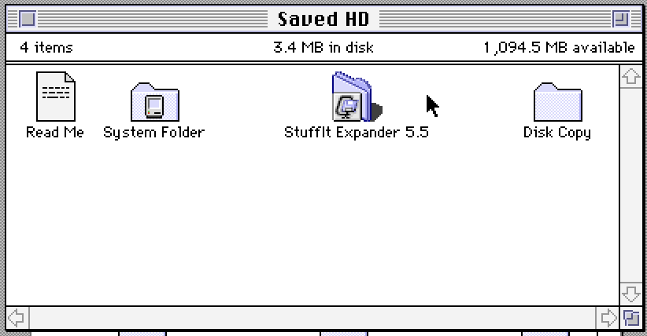

Now, let's put on a few games that we know will work on a black and white Macintosh Plus. Navigate to the "Games" folder in "Infinite HD".

It might be a bit cumbersome to see everything in the games folder, so let's view the files as a list. In the top bar select View->By Name.

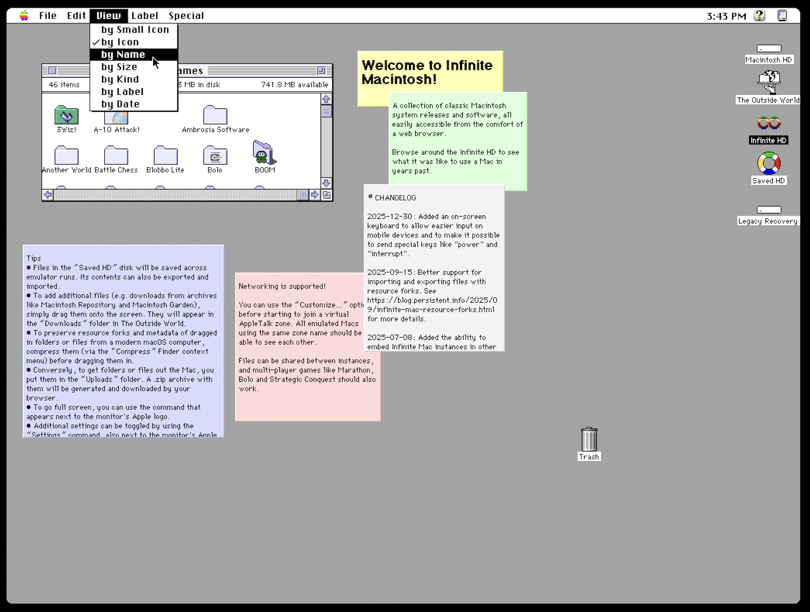

Copy over (or don't, I'm not your mother) the following games by dragging them onto the "Saved HD" icon on your desktop:

- Civilization
- The Oregon Trail
- Missile Command
- Glider

Now we're ready to save our disk image and transfer it to the DS(i).  
Navigate to the top of your screen and select Special->Shut Down.

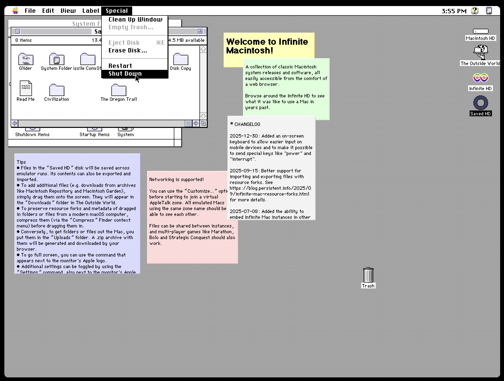

Notice that if you hover over the Apple icon at the lower portion of the virtual monitor, that a small menu appears within the bezel:
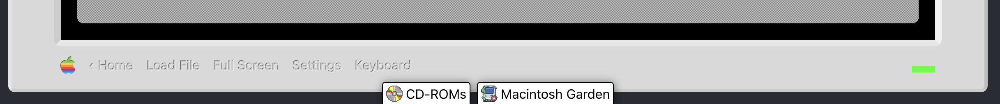

Click on settings and the following dialog will appear:
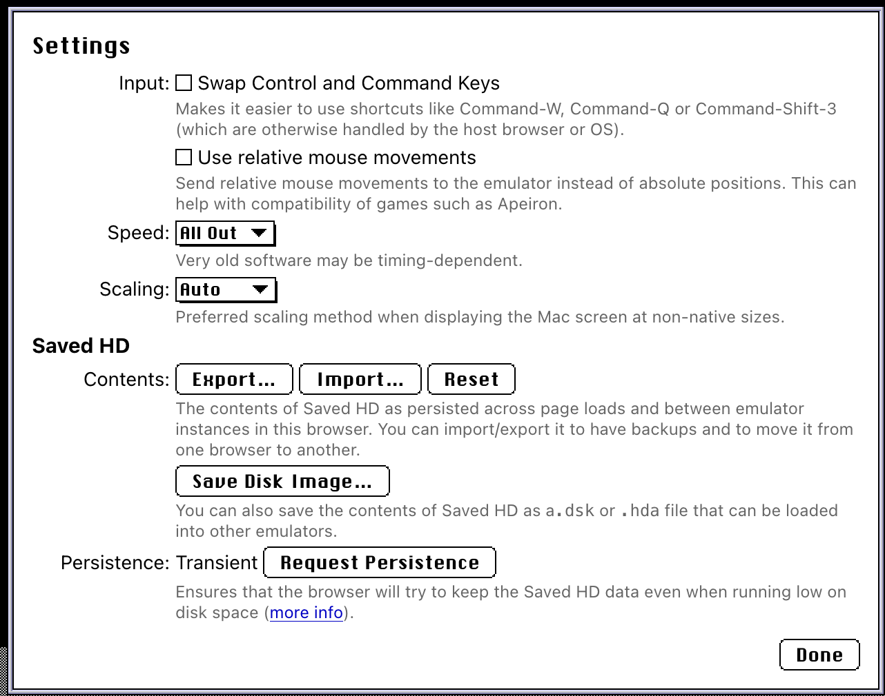

Click on "Save Disk Image..." and when it pops up with another dialog asking to save as a device image or not. Select "Save Image".

The disk image should download onto your computer at this point. If it does not, then you have the same issue I do and need to do one more step.

Close the Infinite Mac tab and open it again in a new tab.  
This time, select "System 6.0.5" from the list of operating systems and click "Run".

Once you're at the desktop, go to the top bar and select Special->Shut Down.
You'll see a message saying that "You may now switch off your Macintosh safely".

Now you can repeat the earlier steps of going to the settings button and clicking "Save Disk Image". Your disk image should now be downloaded.

Take the resulting disk image and copy it to your DS(i) SD card in the /data/minivmac folder.
You can rename it to whatever you want, or name it disk1.dsk in order for it to be automatically loaded when Mini vMac starts up.

Done!
