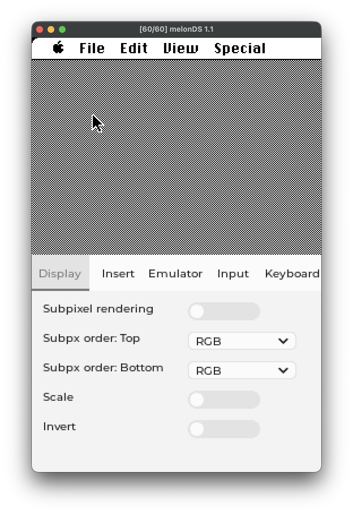
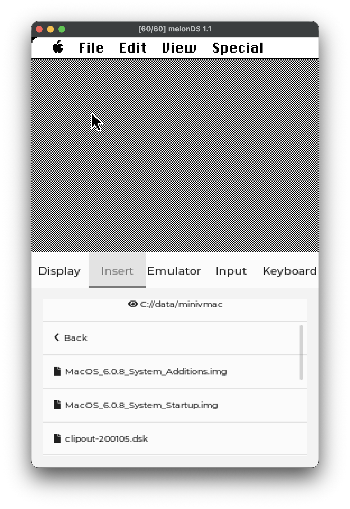
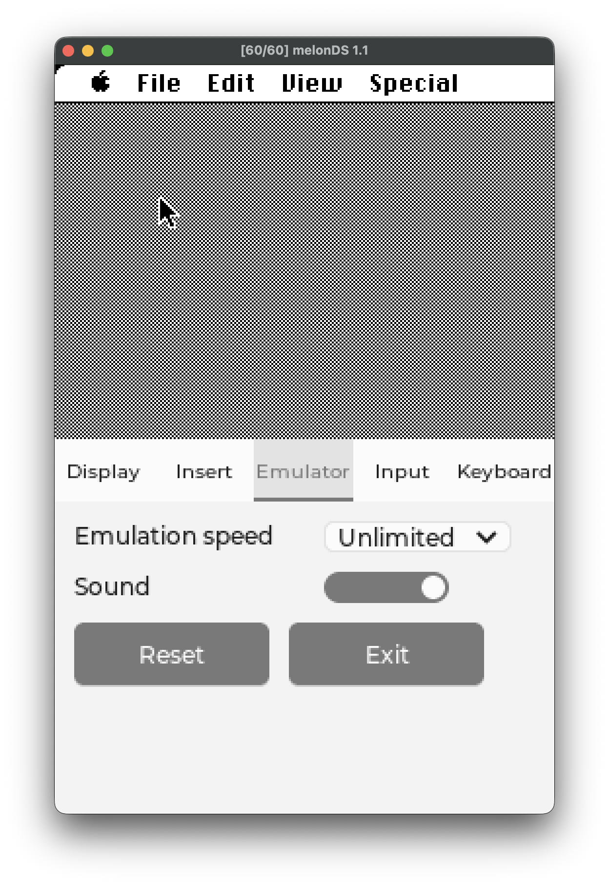
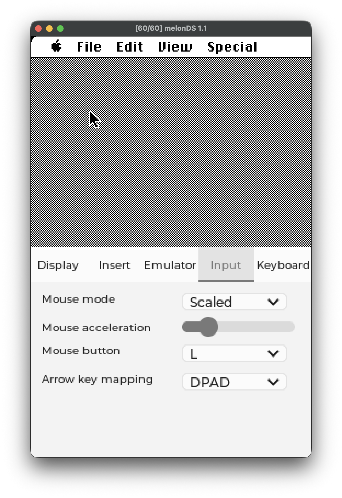
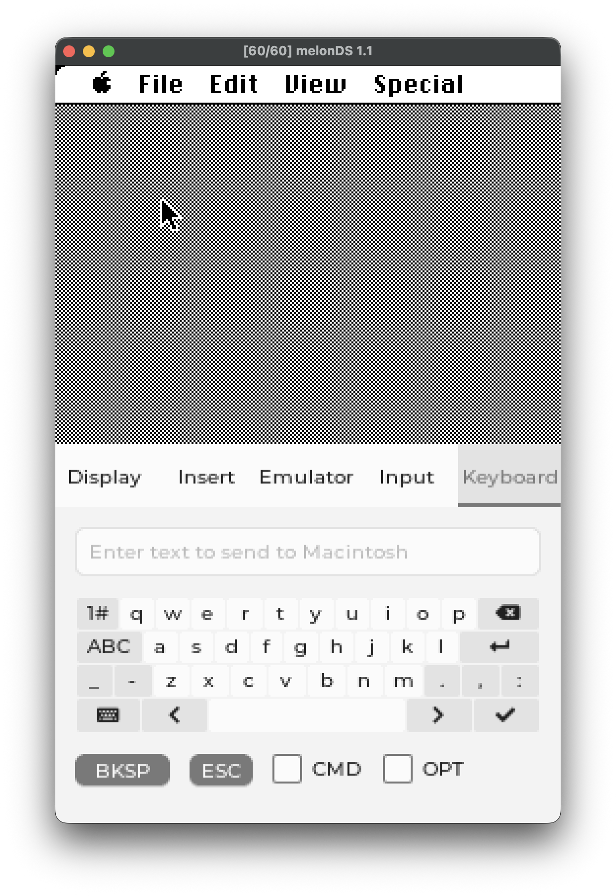

# Default Key Bindings

|Button|Action|
|-|-|
|L|Mouse button|
|Left|Left arrow key|
|Right|Right arrow key|
|Up|Up arrow key|
|Down|Down arrow key|
|Select|Swap screen/enable UI|
|Start|Dismiss emulator message|

# Display Tab

This tab controls emulator display settings.

|Option|Effect|
|-|-|
|Subpixel rendering|May make text more readable in scaled mode|
|Subpixel order: top|Subpixel order for the top screen|
|Subpixel order: bottom|Subpixel order for the bottom screen|
|Scale|Downscales the emulated screen|
|Invert|Inverts the colors of the emulated screen; not available with subpixel rendering|
  

# Insert Tab

This tab allows you to insert disk images and other files at runtime into the emulator.  
  

# Emulator Tab

This tab allows limited configuration and control of the emulator core.

|Option|Effect|
|-|-|
|Emulation speed|Speed the emulator tries to run at|
|Sound|Enables or disables sound (DSi only in builds with sound)|
  

# Input Tab

This tab allows you to configure how the mouse and arrow keys work within the emulator.

|Option|Effect|
|-|-|
|Mouse acceleration|Controls how fast the mouse moves when not in scaled mode|
|Mouse button|Selects which key acts as the mouse button|

- Mouse mode
    Scaled: Tries to map the 256x192 touchscreen onto the 512x342 emulated display
    Trackpad: Emulates a trackpad
    DPAD: The DPAD moves the mouse
    ABXY: The ABXY buttons move the mouse 

- Arrow key mapping
    DPAD: The DPAD is mapped to the keyboard arrow keys
    ABXY: The ABXY buttons are mapped to the keyboard arrow keys
    None: The keyboard arrow keys are not bound to any keys
  
  
# Keyboard Tab

Unlike previous versions, the on screen keyboard does not directly send keys as you press them.  
Instead, what you type goes into a text box which is later sent to the emulator as a series of key strokes.  

That being said, there are a few gotchas:
- The checkmark button sends the text to the emulator, not the return key
- The return button is mapped to the emulated return key

There are extra buttons for backspace and escape in case those are needed within the emulated machine and go directly to the emulator.  
Additionally, there are toggles for command and option in case you need to use a keyboard shortcut.
